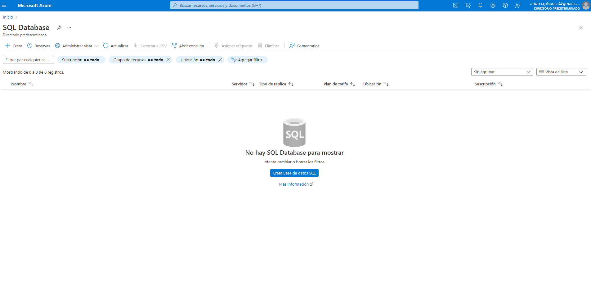
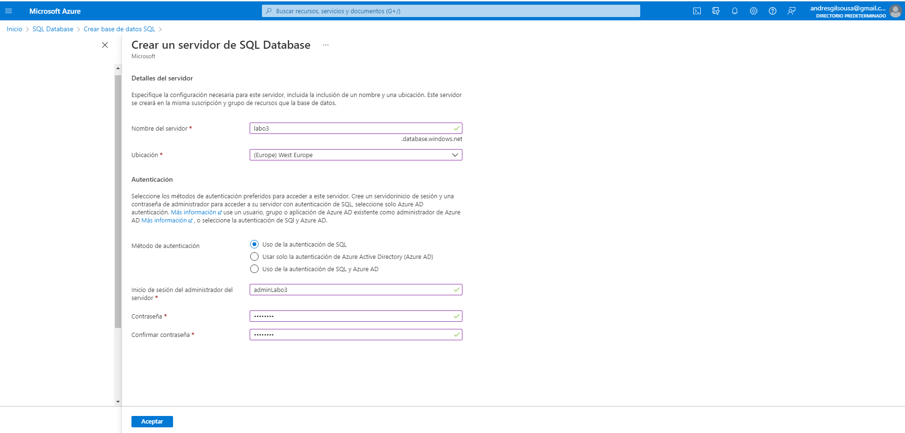
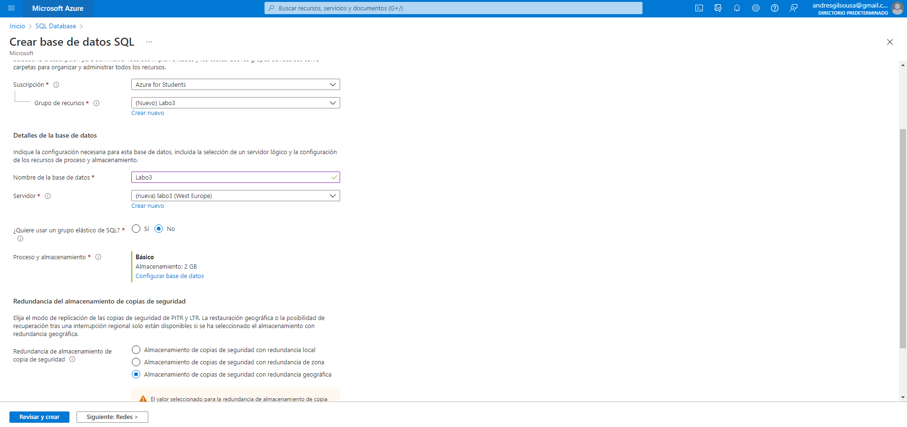
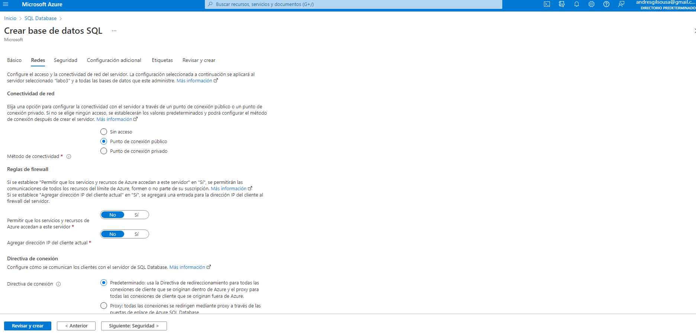
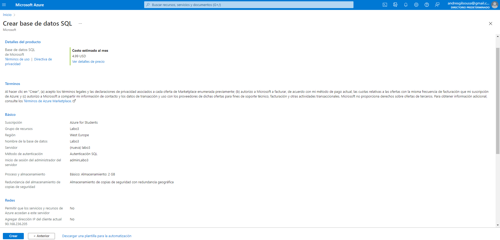
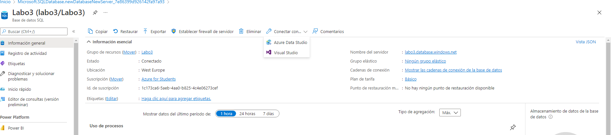
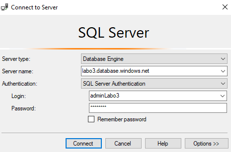
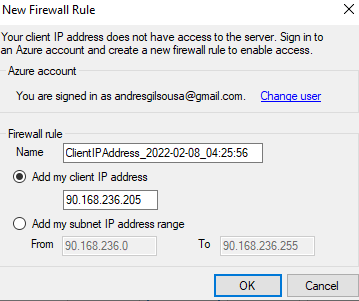
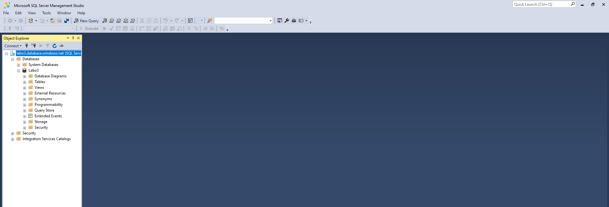

# Creación de Base de Datos SQL

#### 1: Desde Azure Portal, buscamos el servicio: SQL Database. Clicamos en Crear Base de datos SQL.

#### 2: Configuración básica:

- Añadir un Grupo de Recursos (en caso de no tener ninguno, le daremos a "Crear nuevo")
- Establecer el nombre de la base de datos y crear el servidor de SQL Database(hay que poner la región de nuestro servidor, el método de autentificación y el usuario administrador, junto a sus credenciales)
 
- En Proceso y Almacenamiento, tenemos que seleccionar el plan que queramos para nuestra BD (en nuestro caso, como solamente la queremos para comprobar la conexion y crear alguna tabla, seleccionamos la opción básica, ya que es la más barata)

#### 3: En el apartado de redes, lo único que tenemos que establecer es: En conectividad de red, hay que seleccionar la opción de punto de conexión público.

#### 4: Le damos a revisar y crear, comprobamos que todo esté correctamente, y le damos a Crear.

#### 5: Tras un par de minutos, tendremos nuestra base de datos lanzada y funcionando.

# Conexión a la Base de Datos

#### 1:  Apuntamos el nombre del servidor (en nuestro caso es: "labo3.database.windows.net").

#### 2: Nos vamos a conectar usando o Azure Data Studio o SSMS (SQL Server Management Studio). Ponemos la dirección de nuestra base de datos, el nombre del usuario Admin y su contraseña.

#### 3: Tras clicar en conectar, nos solicitará que nos logueemos con nuestra cuenta de azure, y tendremos que establecer una regla para que el firewall nos permita conectarnos con el pc que estemos usando.

#### 4: Ya estamos conectados con la BD, y podemos crear tablas, modificarlas, etc.

